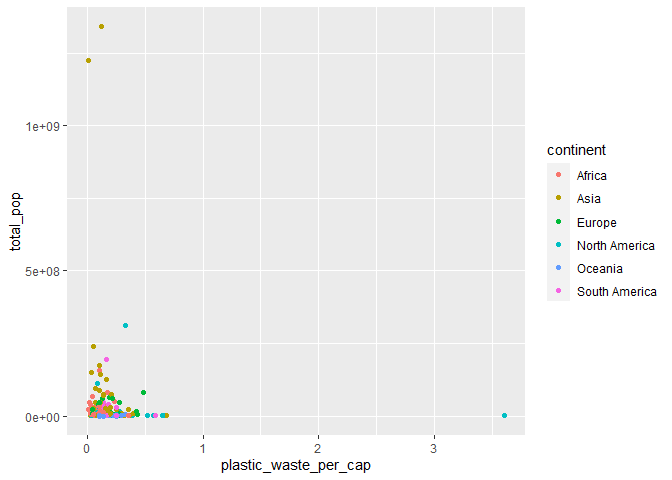
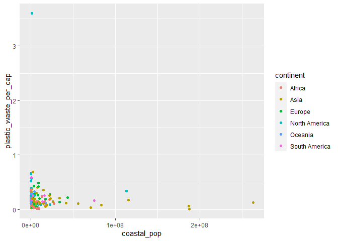

Lauren Latham - Lab 02 - Plastic waste
================
laurenlatham97
2/4/21

## Load packages and data

``` r
library(tidyverse) 
```

``` r
plastic_waste <- read_csv("data/plastic-waste.csv")
```

Below is a histogram of the distribution of plastic waste per capita
faceted by continent. AND WHAT DOES THIS SAY ABOUT HOW COUNTRIES
COMPARE?

``` r
ggplot(plastic_waste, aes(x=plastic_waste_per_cap))+geom_histogram(bins=15)+facet_wrap(~continent)
```

    ## Warning: Removed 51 rows containing non-finite values (stat_bin).

<!-- -->

Below is a density plot demonstrating plastic waste per capita with each
continent color-coded. I lowered the alpha to 0.3 so that data from each
continent can be seen more easily. The color and fill go in the mapping
aesthetics because they are mapped to specific variables, whereas the
alpha information goes in the geom characteristics because it is
information that is used in the same way for each variable (i.e., each
continent).

``` r
ggplot(plastic_waste, aes(x=plastic_waste_per_cap, color=continent, fill=continent))+geom_density(alpha=.3)
```

    ## Warning: Removed 51 rows containing non-finite values (stat_density).

<!-- -->

Below are side by side box plots displaying plastic waste per capita for
each continent:

``` r
ggplot(data = plastic_waste, 
       mapping = aes(x = continent, 
                     y = plastic_waste_per_cap)) +
  geom_boxplot()
```

    ## Warning: Removed 51 rows containing non-finite values (stat_boxplot).

<!-- -->

And violin plots…

``` r
ggplot(data = plastic_waste, 
       mapping = aes(x = continent, 
                     y = plastic_waste_per_cap)) +
  geom_violin()
```

    ## Warning: Removed 51 rows containing non-finite values (stat_ydensity).

<!-- -->

The violin plots are useful because the display the full distribution of
the data, unlike the box plots. OK BUT WHAT DO BOX PLOTS DISPLAY THAT
VIOLIN PLOTS DO NOT? - REVISIT.

Relationship between plastic waste per capita and mismanaged plastic
waste per capita (scatterplot):

``` r
ggplot(data = plastic_waste, 
       mapping = aes(x = plastic_waste_per_cap, 
                     y = mismanaged_plastic_waste_per_cap)) +
  geom_point()
```

    ## Warning: Removed 51 rows containing missing values (geom_point).

<!-- -->

From the above scatterplot we can see that there is a positive
relationship between plastic waste per capita and mismanaged plastic
wast per capita (i.e., as plastic waste per capita goes up, mismanaged
plastic waster per capita also goes up). However, it looks like there
may be two slightly different patterns, with some countries having a
very strong positive relationship between these variables, and other
countries have a somewhat weaker positive relationship.

Relationship between plastic waste per capita and mismanaged plastic
waste per capita (scatterplot-color country):

``` r
ggplot(data = plastic_waste, 
       mapping = aes(x = plastic_waste_per_cap, 
                     y = mismanaged_plastic_waste_per_cap, color = continent)) +
  geom_point()
```

    ## Warning: Removed 51 rows containing missing values (geom_point).

<!-- -->

The above scatterplot demonstrates the same relationship described
earlier between plastic waste per capita and mismanaged plastic waste
per capita, but the color coding makes it easier to understand the two
potentially different patterns. It looks like the relationship between
these variables is weaker for North American and European countries, and
much stronger for other countries.

Relationship between total population and plastic waste per capita
(scatterplot):

``` r
ggplot(data = plastic_waste, 
       mapping = aes(x = total_pop, 
                     y = plastic_waste_per_cap, color = continent)) +
  geom_point()
```

    ## Warning: Removed 61 rows containing missing values (geom_point).

<!-- --> INSERT
EXPLANATION

Relationship between coastal population and plastic waste per capita
(scatterplot):

``` r
ggplot(data = plastic_waste, 
       mapping = aes(x = coastal_pop, 
                     y = plastic_waste_per_cap, color = continent)) +
  geom_point()
```

    ## Warning: Removed 51 rows containing missing values (geom_point).

<!-- --> INSERT
EXPLANATION
