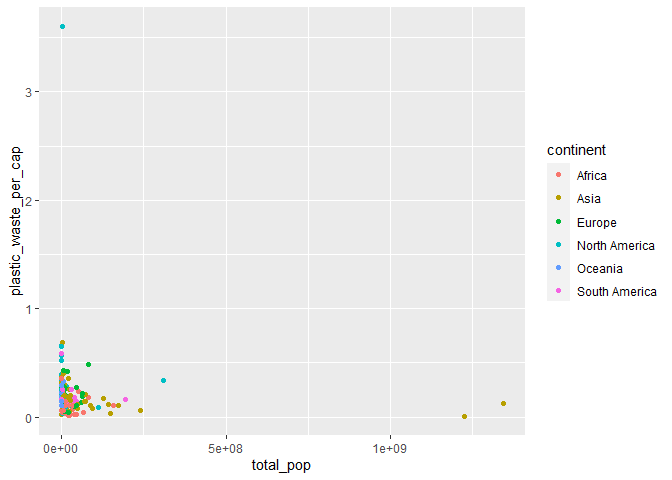

Lab 02 - Plastic waste
================
laurenlatham97
2/4/21

## Load packages and data

``` r
library(tidyverse) 
```

``` r
plastic_waste <- read_csv("data/plastic-waste.csv")
```

Below is a histogram of the distribution of plastic waste per capita
faceted by continent. WHAT DOES THIS SAY ABOUT HOW CONTINENTS COMPARE TO
EACHOTHER??

``` r
ggplot(plastic_waste, aes(x=plastic_waste_per_cap))+geom_histogram(bins=15)+facet_wrap(~continent)
```

    ## Warning: Removed 51 rows containing non-finite values (stat_bin).

<!-- -->

Below is a density plot demonstrating plastic waste per capita with each
continent color-coded. I lowered the alpha to 0.3 data from each
continent can be seen more easily. The color and fill go in the mapping
aesthetics because they are mapped to specific variables, whereas the
alpha information goes in the geom characteristics because it is
information that is used in the same way for each variable (i.e., each
continent).

``` r
ggplot(plastic_waste, aes(x=plastic_waste_per_cap, color=continent, fill=continent))+geom_density(alpha=.3)
```

    ## Warning: Removed 51 rows containing non-finite values (stat_density).

<!-- -->

Below are side by side box plots displaying plastic waste per capita for
each continent:

``` r
ggplot(data = plastic_waste, 
       mapping = aes(x = continent, 
                     y = plastic_waste_per_cap)) +
  geom_boxplot()
```

    ## Warning: Removed 51 rows containing non-finite values (stat_boxplot).

<!-- -->

And violin plots…

``` r
ggplot(data = plastic_waste, 
       mapping = aes(x = continent, 
                     y = plastic_waste_per_cap)) +
  geom_violin()
```

    ## Warning: Removed 51 rows containing non-finite values (stat_ydensity).

<!-- -->

The violin plots are useful because the display the full distribution of
the data, unlike the box plots. OK BUT WHAT DO BOX PLOTS DISPLAY THAT
VIOLIN PLOTS DO NOT? - REVISIT.

scatterplot:

``` r
ggplot(data = plastic_waste, 
       mapping = aes(x = plastic_waste_per_cap, 
                     y = mismanaged_plastic_waste_per_cap)) +
  geom_point()
```

    ## Warning: Removed 51 rows containing missing values (geom_point).

<!-- -->
scatterplot-color:

``` r
ggplot(data = plastic_waste, 
       mapping = aes(x = plastic_waste_per_cap, 
                     y = mismanaged_plastic_waste_per_cap, color = continent)) +
  geom_point()
```

    ## Warning: Removed 51 rows containing missing values (geom_point).

<!-- -->

``` r
ggplot(data = plastic_waste, 
       mapping = aes(x = plastic_waste_per_cap, 
                     y = total_pop, color = continent)) +
  geom_point()
```

    ## Warning: Removed 61 rows containing missing values (geom_point).

<!-- -->

``` r
ggplot(data = plastic_waste, 
       mapping = aes(x = plastic_waste_per_cap, 
                     y = coastal_pop, color = continent)) +
  geom_point()
```

    ## Warning: Removed 51 rows containing missing values (geom_point).

<!-- -->

Still need to work on fixing up these graphs and making interpretations
as instructed in the lab, but the base code is all here.
